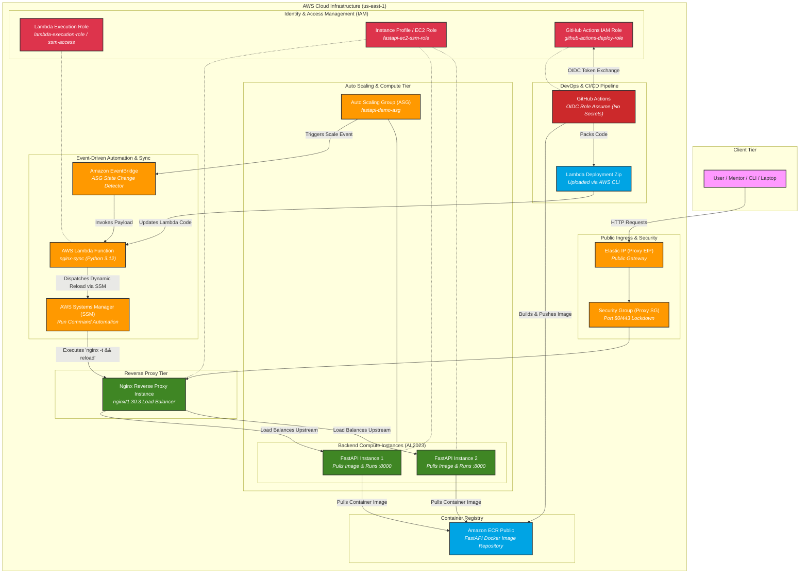

# FastAPI Cloud

A small FastAPI CRUD service deployed on AWS behind an Nginx reverse proxy, running on an Auto Scaling Group, with an event-driven Lambda function that keeps Nginx's upstream config in sync with whatever instances the ASG currently has alive — no load balancer required. Deployment is fully automated with GitHub Actions using OIDC (no long-lived AWS keys stored in CI).

## Table of contents

- [Architecture](#architecture)
  - [Why no load balancer?](#why-no-load-balancer)
- [Components](#components)
- [Tech stack](#tech-stack)
- [Project structure](#project-structure)
- [API](#api)
- [Running locally](#running-locally)
- [Testing](#testing)
- [Testing the live API via curl](#testing-the-live-api-via-curl)
- [CI/CD](#cicd)
- [Infrastructure setup](#infrastructure-setup)
  - [1. Account setup](#1-account-setup)
  - [2. ECR Public repository](#2-ecr-public-repository)
  - [3. IAM — GitHub OIDC + deploy role](#3-iam--github-oidc--deploy-role)
  - [4. IAM — EC2 instance roles](#4-iam--ec2-instance-roles)
  - [5. IAM — Lambda execution role](#5-iam--lambda-execution-role)
  - [6. Networking & security groups](#6-networking--security-groups)
  - [7. Launch template & Auto Scaling Group](#7-launch-template--auto-scaling-group)
  - [8. Nginx proxy](#8-nginx-proxy)
  - [9. Lambda + EventBridge](#9-lambda--eventbridge)
  - [10. CloudFront](#10-cloudfront)
- [Security notes](#security-notes)
- [Possible future improvements](#possible-future-improvements)

## Architecture


### Why no load balancer?

Instead of an Application Load Balancer, this project uses a single Nginx EC2 instance as a reverse proxy in front of the ASG. Nginx's upstream file is kept up to date automatically: whenever the ASG launches or terminates an instance, EventBridge fires, a Lambda function (`nginx-sync`) looks up the current healthy instance IPs, regenerates `upstream.conf`, and pushes it to the Nginx box over SSM (`nginx -t && nginx -s reload`) — no SSH, no static config, no manual intervention.

## Components

| Component | What it does |
|---|---|
| `app/main.py` | FastAPI CRUD service (in-memory item store) — the workload the whole pipeline exists to run |
| `lambda_src/nginx_sync.py` | Lambda handler that discovers healthy ASG instances and rewrites the Nginx upstream config via SSM |
| `scripts/userdata_app.sh` | EC2 user-data for app instances: installs Docker, pulls the image from ECR Public, runs the container |
| `scripts/setup_nginx_proxy.sh` | EC2 user-data for the proxy instance: installs and configures Nginx as a reverse proxy |
| `.github/workflows/deploy-app.yml` | CI/CD for the FastAPI app: test → build/push to ECR Public → trigger ASG instance refresh |
| `.github/workflows/deploy-lambda.yml` | CI/CD for the Lambda: test → package → `update-function-code` → smoke test → verify Nginx config is still valid |
| `deploy-policy.json` | IAM policy attached to the GitHub Actions OIDC role (ECR Public push, ASG refresh, Lambda deploy) |
| `lambda-policy.json` | IAM policy attached to the Lambda execution role (describe ASG/EC2, `ssm:SendCommand`) |
| `trust.json` | OIDC trust policy scoping `github-actions-deploy-role` to this repo only |

## Tech stack

- **App**: FastAPI, Pydantic, Uvicorn (Python 3.12)
- **Container**: multi-stage Docker build, non-root user, built-in `HEALTHCHECK`
- **Compute**: EC2 Auto Scaling Group (Amazon Linux 2023), target-tracking scaling on CPU
- **Ingress**: single Nginx reverse-proxy EC2 instance behind an Elastic IP, fronted by CloudFront (HTTPS, caching)
- **Service discovery**: EventBridge → Lambda (Python 3.12, boto3) → SSM `Run Command`
- **CI/CD**: GitHub Actions, OIDC federation to AWS (no static credentials), ECR Public as the image registry
- **Testing**: pytest, `TestClient` for the API, mocked boto3 clients for the Lambda

## Project structure

```
app/                    FastAPI application
  main.py
lambda_src/              Lambda function source
  nginx_sync.py
scripts/                 EC2 user-data scripts
  userdata_app.sh
  setup_nginx_proxy.sh
tests/                   pytest suite (API + Lambda)
.github/workflows/       CI/CD pipelines
Dockerfile
requirements.txt / requirements-dev.txt
deploy-policy.json       IAM policy for the GitHub Actions OIDC role
lambda-policy.json       IAM policy for the Lambda execution role
trust.json               OIDC trust policy for the GitHub Actions role
```

## API

| Method | Path | Description |
|---|---|---|
| GET | `/` | Basic status + instance ID + version |
| GET | `/health` | Health check (used by the Docker `HEALTHCHECK` and Nginx) |
| POST | `/items` | Create an item — `201` |
| GET | `/items` | List all items |
| GET | `/items/{item_id}` | Fetch one item — `404` if missing |
| PUT | `/items/{item_id}` | Replace an item — `404` if missing |
| PATCH | `/items/{item_id}` | Partially update an item — `404` if missing |
| DELETE | `/items/{item_id}` | Delete an item — `204` |

Item shape: `{ "name": str, "price": float >= 0, "stock": int >= 0 }`. Data lives in an in-memory dict, so it resets whenever the container restarts — this is a demo/reference service, not a production data store.

## Running locally

```bash
python -m venv .venv && source .venv/bin/activate
pip install -r requirements-dev.txt
uvicorn app.main:app --reload
```

Or via Docker:

```bash
docker build -t fastapi-demo:local .
docker run -p 8000:8000 fastapi-demo:local
```

## Testing

```bash
pytest tests/ -v --tb=short          # full suite (API + Lambda)
pytest tests/test_main.py -v         # API only
pytest tests/test_nginx_sync.py -v   # Lambda only (boto3 fully mocked, no AWS calls)
```

## Testing the live API via curl

Once the stack is deployed, exercise the full CRUD flow through the proxy's public address (swap in your own `$PROXY_EIP`, or point at `localhost:8000` for a local run). Capture the generated `id` from the create response instead of hardcoding a UUID — it's random per run.

```bash
export PROXY_EIP="<PROXY_ELASTIC_IP>"

# 1. POST — create an item
curl -i -X POST http://$PROXY_EIP/items \
  -H "Content-Type: application/json" \
  -d '{"name": "Demo Item", "price": 10.50, "stock": 100}'

# Grab the id from the response above (or extract it automatically with jq):
ITEM_ID=$(curl -s -X POST http://$PROXY_EIP/items \
  -H "Content-Type: application/json" \
  -d '{"name": "Demo Item", "price": 10.50, "stock": 100}' | jq -r '.id')

# 2. GET — verify it was created
curl -s http://$PROXY_EIP/items/$ITEM_ID

# 3. PATCH — partially update it (only the fields you send are changed)
curl -i -X PATCH http://$PROXY_EIP/items/$ITEM_ID \
  -H "Content-Type: application/json" \
  -d '{"name": "Updated Demo Item"}'

# 4. DELETE — remove the item
curl -i -X DELETE http://$PROXY_EIP/items/$ITEM_ID

# 5. GET — verify it's gone (list should no longer include it / single-item GET returns 404)
curl -s http://$PROXY_EIP/items
```

Notes:
- `POST` and `PUT` require the full `ItemIn` body (`name`, `price`, `stock`); `PATCH` accepts any subset via `ItemPatch` — sending just `{"name": "..."}` is valid and leaves `price`/`stock` untouched.
- A `DELETE`, `GET`, or `PATCH` against an ID that doesn't exist (already deleted, or copy-pasted incorrectly — e.g. a truncated UUID) returns `404 {"detail": "Item not found"}`, not a silent no-op.
- `POST` returns `201`, `DELETE` returns `204` with an empty body, everything else returns `200`.

## CI/CD

Two independent pipelines, split by path filters so a change to one never triggers the other:

**`deploy-app.yml`** — triggers on changes outside `lambda_src/`:
1. `test`: installs deps, runs `pytest tests/ -v --tb=short`
2. `build-push` (push to `master` only): assumes the GitHub Actions IAM role via OIDC, logs into ECR Public, builds and pushes the image tagged with both the commit SHA and `latest`, then triggers an ASG instance refresh (rolling replacement, 50% min healthy, 90s warmup)

**`deploy-lambda.yml`** — triggers on changes under `lambda_src/`:
1. `test`: runs `pytest tests/test_nginx_sync.py -v`
2. `deploy` (push to `master` only): assumes the same OIDC role, zips `lambda_src/`, calls `update-function-code --publish`, **waits** for `aws lambda wait function-updated` (update-function-code returns before the code is actually live — invoking immediately risks a false-green smoke test against the old code), invokes the function and asserts the response status is `updated` or `no_change`, then runs `nginx -t` on the proxy instance over SSM to confirm the newly deployed Lambda didn't push a config that breaks Nginx.

Authentication uses GitHub's OIDC provider to assume an IAM role (`github-actions-deploy-role`) scoped to this repository — no long-lived AWS access keys are stored as GitHub secrets.

## Infrastructure setup

The steps below are the commands used to stand up the infrastructure from scratch. Replace every placeholder (`<...>`) with your own values — nothing here should be run against someone else's AWS account, and none of the values below are real.

Placeholders used throughout:

| Placeholder | Meaning |
|---|---|
| `<ACCOUNT_ID>` | Your AWS account ID |
| `<VPC_ID>` | Target VPC ID |
| `<GITHUB_ORG>` | Your GitHub org/username |
| `<REPO_NAME>` | This repo's name |
| `<ECR_PUBLIC_ALIAS>` | Your ECR Public registry alias |
| `<PROXY_INSTANCE_ID>` | EC2 instance ID of the Nginx proxy |
| `<PROXY_ELASTIC_IP>` | Elastic IP attached to the proxy instance |
| `<PUBLIC_SUBNET_ID>` | Public subnet ID for the proxy instance |
| `<REGION>` | AWS region (`us-east-1` in this setup) |

### 1. Account setup

```bash
aws sts get-caller-identity
export ACCOUNT_ID="<ACCOUNT_ID>"

aws ec2 describe-vpcs --query 'Vpcs[?IsDefault==`true`].VpcId'
export VPC_ID="<VPC_ID>"
```

Set up a monthly cost budget in Console → Billing → Budgets, then verify:

```bash
aws budgets describe-budgets --account-id $ACCOUNT_ID
```

### 2. ECR Public repository

```bash
aws ecr-public create-repository --repository-name fastapi-demo
aws ecr-public describe-repositories --region us-east-1
export ECR_REPO_URI="<returned-repository-uri>"

# First manual push, before wiring up CI
aws ecr-public get-login-password --region us-east-1 | docker login --username AWS --password-stdin public.ecr.aws
docker tag fastapi-demo:local $ECR_REPO_URI:latest
docker push $ECR_REPO_URI:latest

aws ecr-public describe-image-tags --repository-name fastapi-demo --region us-east-1
```

### 3. IAM — GitHub OIDC + deploy role

Create the OIDC identity provider (one-time per account):

```bash
aws iam create-open-id-connect-provider \
  --url https://token.actions.githubusercontent.com \
  --client-id-list sts.amazonaws.com

aws iam list-open-id-connect-providers
```

`trust.json` (scopes the role to this repo only):
GO to github repo -> Settings → Actions -> OIDC copy the Default subject claim prefix
```json
{
  "Version": "2012-10-17",
  "Statement": [{
    "Effect": "Allow",
    "Principal": { "Federated": "arn:aws:iam::<ACCOUNT_ID>:oidc-provider/token.actions.githubusercontent.com" },
    "Action": "sts:AssumeRoleWithWebIdentity",
    "Condition": {
      "StringEquals": { "token.actions.githubusercontent.com:aud": "sts.amazonaws.com" },
      "StringLike": { "token.actions.githubusercontent.com:sub": "repo:<GITHUB_ORG>@1223/<REPO_NAME>@*" }
    }
  }]
}
```

`deploy-policy.json` grants the role exactly what CI needs: ECR Public auth + push, ASG instance refresh, and Lambda deploy — each scoped to a specific resource ARN where possible (see the file in this repo for the full policy).

```bash
aws iam create-role --role-name github-actions-deploy-role --assume-role-policy-document file://trust.json
aws iam put-role-policy --role-name github-actions-deploy-role --policy-name deploy --policy-document file://deploy-policy.json
aws iam get-role --role-name github-actions-deploy-role
```

Sanity-check the permissions with the policy simulator before relying on them in CI:

```bash
ROLE_ARN=$(aws iam get-role --role-name github-actions-deploy-role --query Role.Arn --output text)

aws iam simulate-principal-policy \
  --policy-source-arn $ROLE_ARN \
  --action-names autoscaling:StartInstanceRefresh \
  --query 'EvaluationResults[].[EvalActionName,EvalDecision]' --output table
```

### 4. IAM — EC2 instance roles

```bash
# App instance role — pulls images from ECR Public, allows SSM management
aws iam create-role --role-name fastapi-app-instance-role \
  --assume-role-policy-document '{"Version":"2012-10-17","Statement":[{"Effect":"Allow","Principal":{"Service":"ec2.amazonaws.com"},"Action":"sts:AssumeRole"}]}'
aws iam attach-role-policy --role-name fastapi-app-instance-role \
  --policy-arn arn:aws:iam::aws:policy/AmazonSSMManagedInstanceCore
aws iam create-instance-profile --instance-profile-name fastapi-app-instance-profile
aws iam add-role-to-instance-profile --instance-profile-name fastapi-app-instance-profile \
  --role-name fastapi-app-instance-role
aws iam put-role-policy --role-name fastapi-app-instance-role --policy-name ECRPublicPullPolicy \
  --policy-document '{"Version":"2012-10-17","Statement":[{"Effect":"Allow","Action":["ecr-public:GetAuthorizationToken","sts:GetServiceBearerToken"],"Resource":"*"}]}'

# Proxy instance role — SSM management only
aws iam create-role --role-name nginx-proxy-instance-role \
  --assume-role-policy-document '{"Version":"2012-10-17","Statement":[{"Effect":"Allow","Principal":{"Service":"ec2.amazonaws.com"},"Action":"sts:AssumeRole"}]}'
aws iam attach-role-policy --role-name nginx-proxy-instance-role \
  --policy-arn arn:aws:iam::aws:policy/AmazonSSMManagedInstanceCore
aws iam create-instance-profile --instance-profile-name nginx-proxy-instance-profile
aws iam add-role-to-instance-profile --instance-profile-name nginx-proxy-instance-profile \
  --role-name nginx-proxy-instance-role
```

> **Gotcha**: if app instances come up but can't run the container, check whether `fastapi-app-instance-role` actually has the `ECRPublicPullPolicy` statement above — without `ecr-public:GetAuthorizationToken` / `sts:GetServiceBearerToken`, `docker login` to ECR Public fails silently in user-data and the instance never gets the image. After fixing the policy, terminate the broken instance (`aws autoscaling terminate-instance-in-auto-scaling-group --should-decrement-desired-capacity false`) — the ASG replaces it automatically.

### 5. IAM — Lambda execution role

`lambda-policy.json` grants `autoscaling:DescribeAutoScalingGroups`, `ec2:DescribeInstances`, and `ssm:SendCommand` (scoped to `AWS-RunShellScript` and the proxy instance ARN once it exists — see [step 7](#7-nginx-proxy) for tightening it further).

```bash
aws iam create-role --role-name fastapi-nginx-sync-lambda-role \
  --assume-role-policy-document '{"Version":"2012-10-17","Statement":[{"Effect":"Allow","Principal":{"Service":"lambda.amazonaws.com"},"Action":"sts:AssumeRole"}]}'
aws iam attach-role-policy --role-name fastapi-nginx-sync-lambda-role \
  --policy-arn arn:aws:iam::aws:policy/service-role/AWSLambdaBasicExecutionRole
aws iam put-role-policy --role-name fastapi-nginx-sync-lambda-role \
  --policy-name asg-ssm --policy-document file://lambda-policy.json

aws iam list-attached-role-policies --role-name fastapi-nginx-sync-lambda-role
aws iam list-role-policies --role-name fastapi-nginx-sync-lambda-role
```

### 6. Networking & security groups

```bash
PROXY_SG=$(aws ec2 create-security-group --group-name nginx-proxy-sg \
  --description "Nginx proxy" --vpc-id $VPC_ID --query GroupId --output text)

APP_SG=$(aws ec2 create-security-group --group-name app-asg-sg \
  --description "FastAPI app instances" --vpc-id $VPC_ID --query GroupId --output text)

# App instances only accept traffic from the proxy SG — never exposed directly
aws ec2 authorize-security-group-ingress --group-id $APP_SG \
  --protocol tcp --port 8000 --source-group $PROXY_SG

# Proxy accepts HTTP from the CloudFront origin-facing prefix list, plus a
# temporary rule for your own IP while testing (removed once CloudFront is live)
PL_ID=$(aws ec2 describe-managed-prefix-lists \
  --filters Name=prefix-list-name,Values=com.amazonaws.global.cloudfront.origin-facing \
  --query 'PrefixLists[0].PrefixListId' --output text)

aws ec2 authorize-security-group-ingress --group-id $PROXY_SG \
  --ip-permissions "IpProtocol=tcp,FromPort=80,ToPort=80,PrefixListIds=[{PrefixListId=$PL_ID}]"

MY_IP=$(curl -s https://checkip.amazonaws.com)
aws ec2 authorize-security-group-ingress --group-id $PROXY_SG --protocol tcp --port 80 --cidr ${MY_IP}/32
aws ec2 authorize-security-group-ingress --group-id $PROXY_SG --protocol tcp --port 22 --cidr ${MY_IP}/32
```

### 7. Launch template & Auto Scaling Group

`scripts/userdata_app.sh` installs Docker, authenticates to ECR Public, and runs the container with `--restart always`, injecting the instance's own ID via IMDSv2.

```bash
AMI_ID=$(aws ssm get-parameter --name /aws/service/ami-amazon-linux-latest/al2023-ami-kernel-default-x86_64 \
  --query Parameter.Value --output text)

aws ec2 create-launch-template --launch-template-name fastapi-demo-lt \
  --launch-template-data "{
    \"ImageId\":\"$AMI_ID\",
    \"InstanceType\":\"t3.micro\",
    \"IamInstanceProfile\":{\"Name\":\"fastapi-app-instance-profile\"},
    \"SecurityGroupIds\":[\"$APP_SG\"],
    \"MetadataOptions\":{\"HttpTokens\":\"required\"},
    \"UserData\":\"$(base64 -w0 scripts/userdata_app.sh)\"
  }"

SUBNETS=$(aws ec2 describe-subnets --filters Name=vpc-id,Values=$VPC_ID \
  --query 'Subnets[0:2].SubnetId' --output text | tr '\t' ',')

aws autoscaling create-auto-scaling-group \
  --auto-scaling-group-name fastapi-demo-asg \
  --launch-template LaunchTemplateName=fastapi-demo-lt,Version='$Latest' \
  --min-size 1 --max-size 2 --desired-capacity 1 \
  --vpc-zone-identifier "$SUBNETS" \
  --health-check-type EC2 --health-check-grace-period 120 \
  --tags "Key=Name,Value=fastapi-app,PropagateAtLaunch=true"

# Target-tracking scaling policy on average CPU
aws autoscaling put-scaling-policy --auto-scaling-group-name fastapi-demo-asg \
  --policy-name cpu-target --policy-type TargetTrackingScaling \
  --target-tracking-configuration '{"PredefinedMetricSpecification":{"PredefinedMetricType":"ASGAverageCPUUtilization"},"TargetValue":15.0}'
```

### 8. Nginx proxy

`scripts/setup_nginx_proxy.sh` installs Nginx and writes a minimal reverse-proxy config (standard `X-Forwarded-*` headers only — no client-controllable IP-spoofing headers).

```bash
AMI_ID=$(aws ssm get-parameter --name /aws/service/ami-amazon-linux-latest/al2023-ami-kernel-default-x86_64 \
  --query Parameter.Value --output text)

PROXY_IID=$(aws ec2 run-instances \
  --image-id $AMI_ID \
  --instance-type t3.micro \
  --subnet-id <PUBLIC_SUBNET_ID> \
  --security-group-ids $PROXY_SG \
  --iam-instance-profile Name=nginx-proxy-instance-profile \
  --user-data file://scripts/setup_nginx_proxy.sh \
  --tag-specifications 'ResourceType=instance,Tags=[{Key=Name,Value=nginx-proxy}]' \
  --query 'Instances[0].InstanceId' --output text)

ALLOCATION=$(aws ec2 allocate-address --domain vpc --query '[AllocationId, PublicIp]' --output text)
ALLOC_ID=$(echo $ALLOCATION | awk '{print $1}')
PUBLIC_IP=$(echo $ALLOCATION | awk '{print $2}')
aws ec2 associate-address --instance-id $PROXY_IID --allocation-id $ALLOC_ID
```

Once the proxy instance exists, tighten the Lambda's `ssm:SendCommand` permission from a wildcard to this specific instance ARN:

```bash
REGION=$(aws configure get region || echo "us-east-1")
aws iam put-role-policy \
  --role-name fastapi-nginx-sync-lambda-role \
  --policy-name asg-ssm \
  --policy-document "{
    \"Version\": \"2012-10-17\",
    \"Statement\": [{
      \"Effect\": \"Allow\",
      \"Action\": [\"ssm:SendCommand\"],
      \"Resource\": [
        \"arn:aws:ec2:${REGION}:${ACCOUNT_ID}:instance/${PROXY_IID}\",
        \"arn:aws:ssm:${REGION}::document/AWS-RunShellScript\"
      ]
    }]
  }"
```

### 9. Lambda + EventBridge

```bash
cd lambda_src && zip -r ../function.zip . && cd ..

aws lambda create-function --function-name nginx-sync \
  --runtime python3.12 --handler nginx_sync.handler \
  --role arn:aws:iam::$ACCOUNT_ID:role/fastapi-nginx-sync-lambda-role \
  --zip-file fileb://function.zip --timeout 30 --memory-size 128 \
  --environment "Variables={ASG_NAME=fastapi-demo-asg,PROXY_INSTANCE_ID=$PROXY_IID,PROBE_ENABLED=0}"

# Manual smoke test
aws lambda invoke --function-name nginx-sync --payload '{}' /tmp/out.json
cat /tmp/out.json   # expect {"status":"updated","instances":["10.x.x.x"],...}

# EventBridge rule — fires on ASG launch/terminate for this specific ASG
aws events put-rule --name asg-lifecycle-to-nginx \
  --event-pattern '{"source":["aws.autoscaling"],"detail-type":["EC2 Instance Launch Successful","EC2 Instance Terminate Successful"],"detail":{"AutoScalingGroupName":["fastapi-demo-asg"]}}'

aws events put-targets --rule asg-lifecycle-to-nginx \
  --targets "Id=1,Arn=arn:aws:lambda:us-east-1:$ACCOUNT_ID:function:nginx-sync"

aws lambda add-permission --function-name nginx-sync \
  --statement-id eventbridge-invoke --action lambda:InvokeFunction \
  --principal events.amazonaws.com \
  --source-arn arn:aws:events:us-east-1:$ACCOUNT_ID:rule/asg-lifecycle-to-nginx
```

Integration test — scale the ASG up and confirm both IPs land in the upstream config, then scale back down:

```bash
aws autoscaling set-desired-capacity --auto-scaling-group-name fastapi-demo-asg --desired-capacity 2
# wait ~3 min
aws logs tail /aws/lambda/nginx-sync --since 5m
```

### 10. CloudFront

Fronts the Nginx Elastic IP with HTTPS, compression, and a viewer-protocol redirect to HTTPS. Once the distribution is deployed and verified, the temporary "my IP" rule on the proxy security group is revoked, so the proxy is only reachable through CloudFront:

```bash
aws cloudfront create-distribution --distribution-config '{
  "CallerReference": "<unique-value>",
  "Comment": "FastAPI Nginx Proxy CDN",
  "Enabled": true,
  "Origins": {
    "Quantity": 1,
    "Items": [{
      "Id": "NginxProxyOrigin",
      "DomainName": "<PROXY_ELASTIC_IP>",
      "CustomOriginConfig": {
        "HTTPPort": 80, "HTTPSPort": 443,
        "OriginProtocolPolicy": "http-only",
        "OriginSslProtocols": { "Quantity": 1, "Items": ["TLSv1.2"] }
      }
    }]
  },
  "DefaultCacheBehavior": {
    "TargetOriginId": "NginxProxyOrigin",
    "ViewerProtocolPolicy": "redirect-to-https",
    "AllowedMethods": {
      "Quantity": 7, "Items": ["GET","HEAD","OPTIONS","PUT","POST","PATCH","DELETE"],
      "CachedMethods": { "Quantity": 2, "Items": ["GET","HEAD"] }
    },
    "Compress": true,
    "CachePolicyId": "4135ea2d-6df8-44a3-9533-4f5c0dcee47f",
    "OriginRequestPolicyId": "216adef4-97f7-4b7b-9500-da8cc38287c2"
  },
  "Restrictions": { "GeoRestriction": { "RestrictionType": "none", "Quantity": 0 } },
  "ViewerCertificate": { "CloudFrontDefaultCertificate": true }
}'

# After the distribution reports "Deployed", lock the proxy SG down to CloudFront only:
MY_IP=$(curl -s http://checkip.amazonaws.com)
aws ec2 revoke-security-group-ingress --group-id $PROXY_SG --protocol tcp --port 80 --cidr ${MY_IP}/32
```

## Security notes

- GitHub Actions authenticates via OIDC federation — no static AWS access keys live in repo secrets.
- The `github-actions-deploy-role` trust policy (`trust.json`) is scoped with `StringLike` on `token.actions.githubusercontent.com:sub` to this specific repository, not the whole GitHub org.
- App instances are never internet-facing: the app security group only accepts port 8000 from the proxy security group.
- The proxy security group is locked down to the CloudFront origin-facing managed prefix list once CloudFront is live; direct EIP access on port 80 is revoked.
- The Lambda's `ssm:SendCommand` permission is scoped to the specific proxy instance ARN and the `AWS-RunShellScript` document, not `Resource: "*"`.
- All EC2 instances use IMDSv2 only (`HttpTokens: required`) and are managed via SSM Systems Manager rather than SSH/open port 22 (the port-22 rule from setup is temporary and scoped to a single IP).
- Nginx forwards only standard, safe proxy headers (`X-Real-IP`, `X-Forwarded-For`, `X-Forwarded-Proto`) — no client-controllable headers that could be used to spoof the origin IP.

## Possible future improvements

- Turn on Docker layer caching in the `deploy-app.yml` build step. The IAM policy already grants `ecr-public:BatchCheckLayerAvailability` (lets Docker skip re-uploading unchanged layers, e.g. the Python 3.12 base), but the workflow doesn't yet enable BuildKit registry/cache-from caching to take advantage of it.
